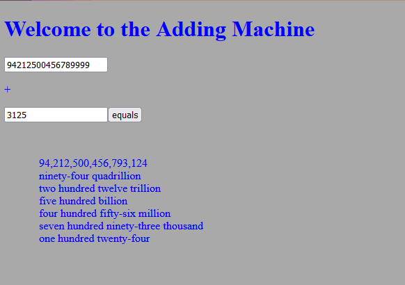

Adds big numbers

Screenshot:

TODO:
fix bugs
make content centered
make wordform variation in spanish
account for bigger numbers than quadrillion

Bugs to be fixed:
wordForm
if 000 in any group of three we still display the suffix which is wrong (e.g. 1,000,123 => one million thousand one hundred twenty-three)
